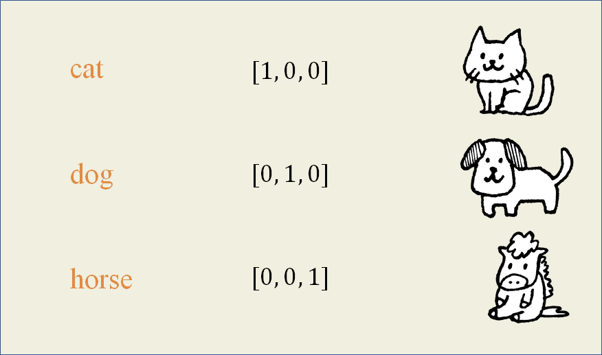
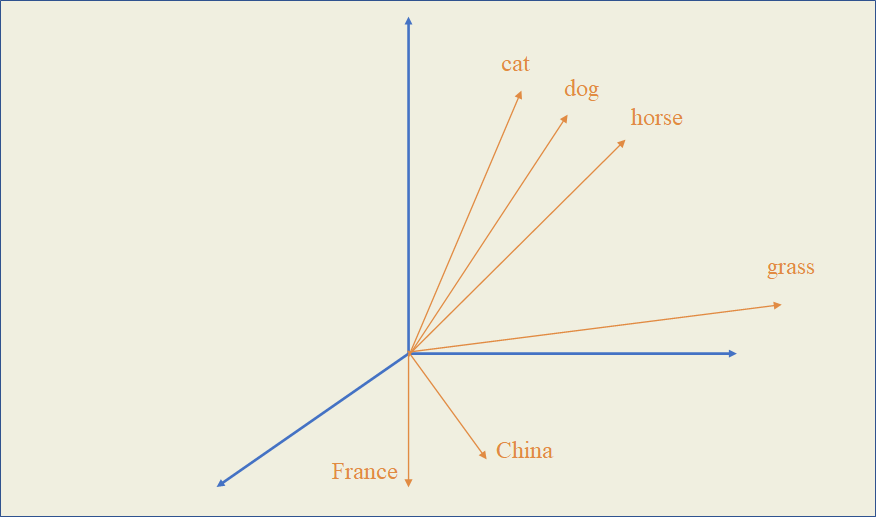
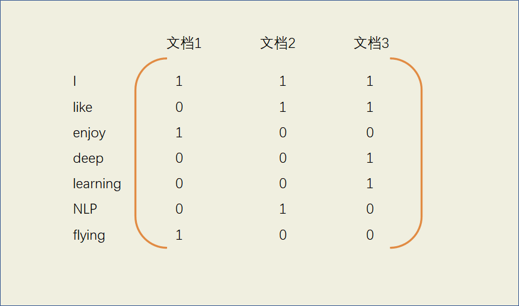
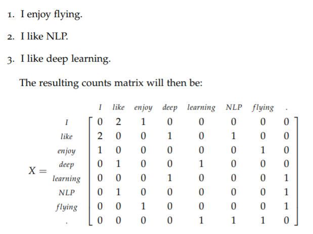
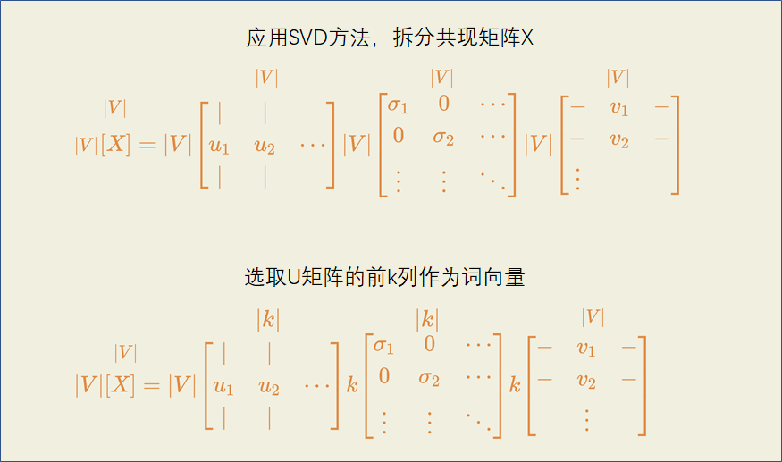
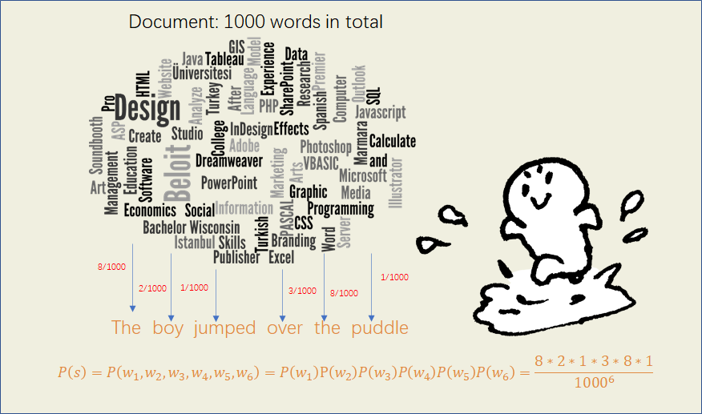
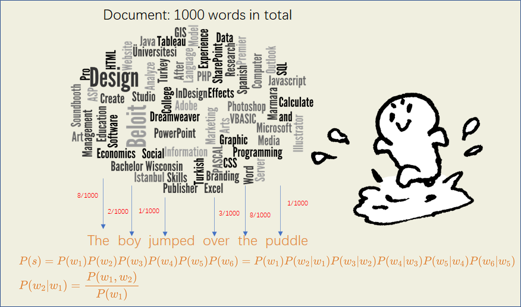
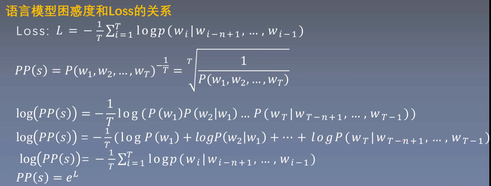

人类看到文字就能直接知道它的含义，因为对于人类来说文字本身就包含了信息，但机器并不能做到直接通过文字本身去理解含义。因为计算机是在数字中挖掘信息的，所以我们得将文字以数值的方式呈现，向量就是一种很好的表达方式。

# one-hot representation

这种表示方法把单词看作基础符号，每个词是一个长向量，其维度是整个词表（vocabulary）的大小，其中只有一个维度的值为1，其余维度全为0。

例如，当词表中一共三个词（cat, dog, horse）时，它们用向量的表示形式如下图。

优点：表示简单

缺点：One-hot编码把每个词独立地表示，无法体现词语之间的相关性。当词语的数量庞大时维度过多，向量过于稀疏。

One-hot是一种离散表示（Localist Representation）词向量的方法，每个词语相互没有关联性。

但现实情况是，词语之间是有相关性的，看到cat就能想到dog，看到apple就能想到orange，看到king就能想到queen，这些词具有相似或相反的含义，我们想用一些方法表现出它们之间的关联性。

分布式表示（Distributed Representation）就是这样的表示方法，它与离散表示相对应，基于**分布假说**：上下文相似的词，其语义也相似。

分布式表示构建稠密向量来表示词汇，这样的词向量可以表现出词语之间的相关性。在向量中，词语与词语之间在每个维度上的值会有差距，每个维度表示词语的不同特征值，词语的向量值越接近，表示它们越相似，这个差距可以通过两个点之间的距离来衡量，也可以通过两个向量中间的夹角来衡量。

如果生成的词向量有三个维度，每个维度蕴含了不同的特征信息，那么下图能大致表示几个词在整个空间内的位置关系

在这个三维空间中，cat、dog、horse都属于动物，有着相似的语义，所以它们之间的距离以及围成的夹角都比较小，而France和China都是国家，位置上互相接近但距离动物类别的词语比较远。

像比于One-hot编码，词向量表示使用了少得多的维度，整个向量更为紧凑，蕴含了更多的信息。

# 基于矩阵的词表示

这一类表示词语的方法都是分布式表示，在一定程度上能体现词语的相似度。

## 1. 词-文档矩阵（Word-Document Matrix）

将单词在文档中出现的频率作为值插入到矩阵中，得到词向量。

例如：

文档1：I enjoy flying.

文档2：I like NLP.

文档3：I like deep learning.

则基于每个单词出现的频率，得到的词向量为：

如果词表大小为$V$，文档数量为$M$，则该矩阵的大小为$V * M$，当文档数量增加时，矩阵大小随之增加。

## 2. 基于窗口区间的共现矩阵（Window based Co-occurrence Matrix）

在总数为$V$的词表中，给定一个特定的区间（window），计算在每个词附近区间内的其他词出现的次数，构造了一个完整的$V*V$的矩阵$X$。

如果两个词的附近区间都多次出现了相同的词，那么这两个词很有可能有相同的语义。除了语义信息外，还可以通过这个矩阵获得一定的语法（词性）信息。

例如：

source: http://web.stanford.edu/class/cs224n/readings/cs224n-2019-notes01-wordvecs1.pdf

可以看到，$like$和$enjoy$的附近区间里都有$I$的出现，所以它们的语义应该相似。

然而，$X$是一个$V*V$的矩阵，当词表数量$V$非常大时，得到的共现矩阵会非常大，需要想办法降维。

**应用SVD是一种较为有效的解决方法**

基于矩阵的词表示能得到包含一定信息的词向量，但是也有一些缺点。

- 作为有监督学习的模型，当词表有增删或者词语有变动时，$X$也要随着改变，特别是向量的维度可能会变化，耗时耗力
- 因为文档中很多词并不会互相在附近出现，所以会十分地稀疏，浪费了大量的维度空间
- 使用SVD对共现矩阵降维的话，需要大量的计算量：$O(V^2)$
- 一些出现频繁但实际意义不大的词会影响矩阵分解的结果
- 很难体现一词多义

有一些方法能够提高的效率

- 去除停用词（stop words），如$the, a, she$等
- 基于中心词和附近词的距离来作为值
- 使用皮尔森相关性系数来作为值

# 基于语言模型

为了解决以上的这些问题，可以使用语言模型（无监督模型）。

**语言模型：用来计算一个语言序列出现的概率，可以不断修正词语的排序得到一个通顺合理的句子。**

通俗地说，语言模型就是计算一句话是人话的概率有多高，看起来越自然越像人话的句子，构建的语言模型中给出的概率就应该越高。

- 为什么语言模型要计算一个句子出现的概率？有哪些应用？

  例如在机器翻译任务中，"I am going to school."的概率应该远大于"I am flying to school"的概率，因此判断第一个句子更有可能为对的；语音识别任务中，"I saw a van"的概率应该远大于"Eyes awe of an"的概率；手机键盘的自动补全；搜索引擎的关键词补全等。

另外一种情况是给定前几个词，预测下一个词出现的概率有多高，这种模型也是语言模型。

## 基于专家语法规则的语言模型

通过一些语法规则来判断句子是否是人话的概率，比如形容词后应该接名词

但是现实中的词语是千变万化的，不断增加的网络用语也让这种规则很难通用；

即使一句话的语法规则完全正确，它也很有可能是一句几乎不会存在的话，比如”The apple is eating an elephant.”

## 统计语言模型

一个句子的概率如何计算？根据条件概率

$P(s)=P(w_1,w_2,...,w_n)=P(w_1)P(w_2|w_1)P(w_3|w_1,w_2)...P(w_n)|P(w_{n-1},w_{n-2},...,w_1)$

当句子很长的时候，这样计算得到的概率会非常小，甚至为0，因为前置太多，词语一起出现的频率小。

采用马尔可夫假设可以解决这个问题：一个词语出现的概率可以通过与它相近的词语预测概率得出。

$P\left(w_{1} w_{2} \ldots w_{n}\right) \approx \prod_{i} P\left(w_{i} \mid w_{i-k} \ldots w_{i-1}\right)$，k为取相近词的个数

如果通过其前面的一个词来预测，为First Order Markov Assumption，是Bigram语言模型

如果通过其前面的三个词来预测，为Second Order Markov Assumption，是Trigram语言模型

如果通过其前面的N个词来预测，是N-gram语言模型

最基础的，如果假设每个词出现的概率相互独立，则是Unigram语言模型。

1. Unigram

给定一句话：

The boy jumped over the puddle.

为了计算这句话出现（是人话）的概率，Unigrams假设每个词语出现的概率相互独立，通过计算句子里的 每一个词在全文中出现的频率，并将它们累乘起来得到最终的概率。

Unigram model: $P\left(w_{1}, w_{2}, \cdots, w_{n}\right)=\prod_{i=1}^{n} P\left(w_{i}\right)$， $P(w_i)=\frac{count(w_i)}{count(doc)}$

Unigram只考虑每个词在文档中的频率，没有考虑上下文的影响，所以只要句子中出现的词语出现的频次越高它的概率就会越高，比如"A student he is"是一个没有意义的句子，但其中每个词都是高频词，因此Unigram语言模型赋予的概率就会很高，与"He is a student"有相同的概率，这显然是不合理的。

2. Bigram

考虑句子中相邻词语的互相影响，Bigram计算每个词关于其上一个词的条件概率并累乘，一定程度上可以改进语言模型的准确度。

但有些时候仅凭一个前置词来预测下一个词的概率还是不够准确，比如"The dog on the roof barked"，想要预测句子中barked最后出现的概率，如果仅凭前面的roof，给出barked的概率是非常低的。

3. N-gram

与上面的语言模型同理，N-gram就是计算每个词关于其之前的N-1个词的条件概率并累乘，更多的前置词通常会带来更合理的预测。

**平滑操作**

在计算句子出现的概率时，会出现某一个词在语料库中从未出现的情况，这时不管使用上面哪一种语言模型，最后计算出的概率都为0，这显然是不合理的。

例如给定下面的语料库：

THe boy jumped over the puddle.

She is a cute girl.

There is a boy on the street.

如果使用Unigram语言模型，则

$P("He\ is\ not\ a\ boy")=P(He)P(is)P(not)P(a)P(boy)=\frac{0*2*0*2*2}{18^5}=0$，

因为he和not在语料库在没有出现，同理Bigram等模型的计算结果也是0。

可以采用平滑操作（拉普拉斯平滑），即使句子中没有出现某个词语，也给其赋予1的频次，语料库整体数量也相应增加，则

$P("He\ is\ not\ a\ boy")=P(He)P(is)P(not)P(a)P(boy)=\frac{1*2*1*2*2}{20^5}=\frac{8}{20^5}$

**对数化操作**

在使用统计语言模型时，最终计算得到的概率很可能非常小，不利于统计和比较，于是可以使用对数化操作，从相乘变为对数相加来让最终的数据变得可控。

$\log \prod p\left(w_{i} \mid w_{i-1}\right)=\sum \log p\left(w_{i} \mid w_{i-1}\right)$

**问题**

统计语言模型是一种离散模型，有很高的稀疏性，即很多的词语在语料中根本不会出现或者出现概率低，造成最终计算的概率非常小，使用平滑操作只能一定程度上缓解；统计语言模型的泛化能力比较低，语料的大小很大程度上决定了模型的效果；这种模型也不能体现出词语之间的相似性。

## 语言模型的评估方法 —— 困惑度 Perplexity

$\begin{aligned}P P(W) &=P\left(w_{1} w_{2} \ldots w_{N}\right)^{-\frac{1}{N}} \\&=\sqrt[N]{\frac{1}{P\left(w_{1} w_{2} \ldots w_{N}\right)}}\end{aligned}$

对于Bigram:

$\operatorname{PP}(W)=\sqrt[N]{\prod_{i=1}^{N} \frac{1}{P\left(w_{i} \mid w_{i-1}\right)}}$

困惑度越低，模型的准确率越高。

