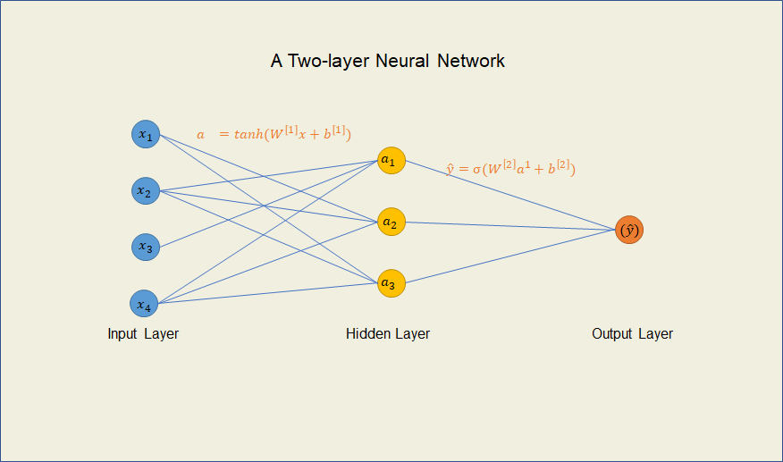
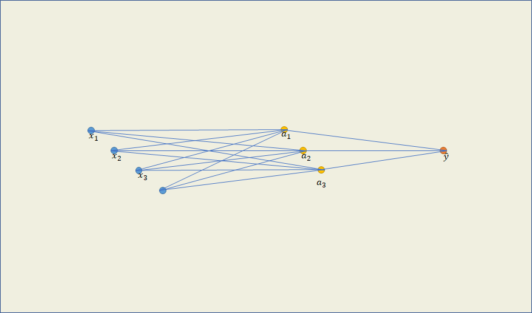
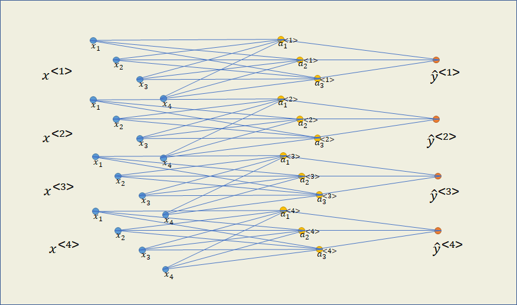
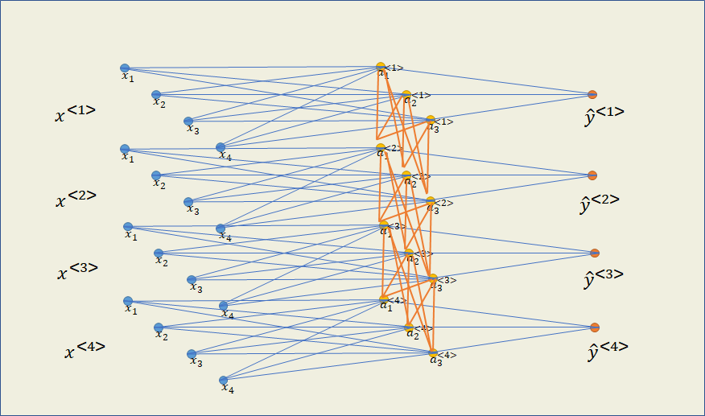
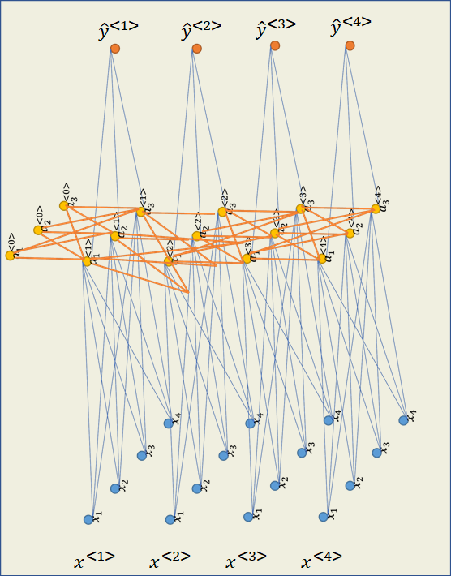

# 循环神经网络

## 引入

上一章中我们介绍了词的一些表示方法，现在计算机已经把我们输入的文字转换为数字表示，试试用传统的前馈神经网络进行训练会怎么样。

***前馈神经网络在处理NLP任务时的问题***

1. 在大多数的NLP任务中，输入和输出都是不固定的。比如在机器翻译的任务中，输出句子的词语数是不断变化的，而前馈神经网络需要固定这个值；
2. 同一个词语在句子中的不同位置作为输入时，神经网络学习到的信息不能共享；
3. 有时候输入的数据是和时间相关的，比如实时翻译、语音识别等，前馈神经网络需要一次输入不能应用到这些情景，也就是说它不具备记忆性。

因此，我们需要一个可以进行动态输入而且具备记忆力的神经网络来处理文本数据。

假设我们要做一个情感分析任务，通过输入的句子分析它表达的是积极态度还是消极态度。输入是每个句子，句子中每个词语经过了One-hot编码，输出是0（消极）或1（积极）。

例如用于训练的一个句子：

I am a student.

先忽略标点符号，将句子进行One-hot编码后得到：

I [1, 0, 0, 0]

am [0, 1, 0, 0]

a [0, 0, 1, 0]

student [0, 0, 0, 1]

## 结构

先看下传统的前馈神经网络结构



上图是一个两层前馈神经网络中的示意图，$x_i$表示输入的每个词语的特征，例如输入am后，$x_1 = 0, x_2 = 1, x_3=0,x_4=0$。$a$表示隐藏层的输出（activation），$\hat{y}$表示神经网络的输出，具体值为0或1。隐藏层全部使用tanh激活函数，输出层使用Sigmoid激活函数。


为了方便观察，我们把神经网络结构进行3D化：



因为有四个词语，我们表示出训练过程中的四个神经网络，用$x^{<t>}$表示第$t$个词语



以每个样本你（词语）为单位，现在的前向传播为：

$a^{<t>}=tanh(W_ax^{<t>}+b_a)$

$\hat{y}^{<t>}=\sigma{(W_y a^{<t>}+b_y)}$

其中$W_a,b_a$表示隐藏层中的权重和偏置，$W_y,b_y$表示输出层中的权重和偏置。

但是目前的每个样本（词语）是独立进行训练的，输入为每个词语的One-hot编码，为了让神经网络具有记忆性，我们让神经网络之间建立联系，除了本身样本的输入外，让上一个样本的隐藏层输出（$a^{<i-1>}$）也作为输入的一部分



因为第一个样本输入时不存在$a^{<t-1>}（$即$a^{<0>}$），可以将$a^{<0>}$的值全部初始化为0。


如果将示意图旋转，图示如下：



## 前向传播

现在的前向传播为：

$a^{<t>}=tanh(W_{aa}a^{<t-1>}+W_{ax}x+b_a)$

$\hat{y}^{<t>}=\sigma{(W_{ya}a^{<t>}+b_y)}$

其中为了区分隐藏层中两个输入的权重，用$W_{aa}$表示上一个样本的隐藏层输出（$a^{<t-1>}$）的权重，用$W_{ax}$表示当前样本的输入的权重。

```python
def rnn_cell_forward(xt, a_prev, parameters):
    
    # Retrieve parameters from "parameters"
    Wax = parameters["Wax"]
    Waa = parameters["Waa"]
    Wya = parameters["Wya"]
    ba = parameters["ba"]
    by = parameters["by"]
    
    ### START CODE HERE ### (≈2 lines)
    # compute next activation state using the formula given above
    a_next = np.tanh(np.dot(Waa, a_prev) + np.dot(Wax, xt) + ba)
    # compute output of the current cell using the formula given above
    yt_pred = softmax(np.dot(Wya, a_next) + by)
    ### END CODE HERE ###
    
    # store values you need for backward propagation in cache
    cache = (a_next, a_prev, xt, parameters)
    
    return a_next, yt_pred, cache
```


关于维度：

输入层中，$x^{<t>}$的形状为$(4, 1)$，

隐藏层中，$a^{<t-1>}的形状为$$(3,1)$；$W_{ax}$的形状为$(3, 4)$；$W_{aa}$的形状为$(3, 3)$；$b_a$的形状为$(3,1)$；$a^{<t>}$的形状为$(3,1)$

输出层中，$W_{ya}$的形状为$(1, 3)$；$b_y$的形状为$(1,1)$；$\hat{y}^{<t>}$的形状为$(1,1)$

