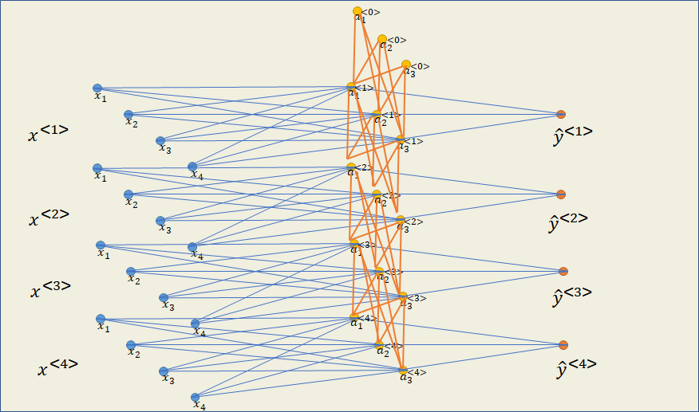
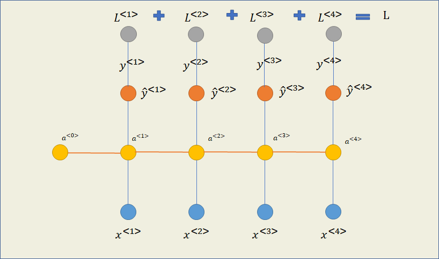
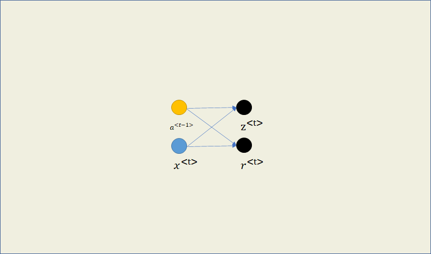

# 循环神经网络

## 引入

上一章中我们介绍了词的一些表示方法，现在计算机已经把我们输入的文字转换为数字表示，试试用传统的前馈神经网络进行训练会怎么样。

***前馈神经网络在处理NLP任务时的问题***

1. 在大多数的NLP任务中，输入和输出都是不固定的。比如在机器翻译的任务中，输出句子的词语数是不断变化的，而前馈神经网络需要固定这个值；
2. 同一个词语在句子中的不同位置作为输入时，神经网络学习到的信息不能共享；
3. 有时候输入的数据是和时间相关的，比如实时翻译、语音识别等，前馈神经网络需要一次输入不能应用到这些情景，也就是说它不具备记忆性。

因此，我们需要一个可以进行动态输入而且具备记忆力的神经网络来处理文本数据。

例如用于训练的一个句子：

I am a student.

先忽略标点符号，将句子进行One-hot编码后得到：

I [1, 0, 0, 0]

am [0, 1, 0, 0]

a [0, 0, 1, 0]

student [0, 0, 0, 1]

## 结构

先看下传统的前馈神经网络结构


上图是一个两层前馈神经网络中的示意图，$x_i$表示输入的每个词语的特征，例如输入am后，$x_1 = 0, x_2 = 1, x_3=0,x_4=0$。$a$表示隐藏层的输出（activation），$\hat{y}$表示神经网络的输出，具体值为0或1。隐藏层全部使用tanh激活函数，输出层使用Sigmoid激活函数。


为了方便观察，我们把神经网络结构转变为俯视角度：


因为有四个词语，我们表示出训练过程中的四个神经网络，用$x^{<t>}$表示第$t$个词语


以每个样本你（词语）为单位，现在的前向传播为：

$a^{<t>}=tanh(W_ax^{<t>}+b_a)$

$\hat{y}^{<t>}=\sigma{(W_y a^{<t>}+b_y)}$

其中$W_a,b_a$表示隐藏层中的权重和偏置，$W_y,b_y$表示输出层中的权重和偏置。

但是目前的每个样本（词语）是独立进行训练的，输入为每个词语的One-hot编码，为了让神经网络具有记忆性，我们让神经网络之间建立联系，除了本身样本的输入外，让上一个样本的隐藏层输出（$a^{<i-1>}$）也作为输入的一部分


因为第一个样本输入时不存在$a^{<t-1>}（$即$a^{<0>}$），可以将$a^{<0>}$的值全部初始化为0，这是RNN最直观的一种展示方法。



还有一些简化版的表示方法，如果将示意图旋转，图示如下：


将每层的神经元省略后表示，图示如下：


更省略的一种表示方法，只展示一个样本输入，图示如下：


## 初始化参数

隐藏层的权重有两个，$W_{ax}$的形状取决于隐藏层的神经元个数和输入层的神经元个数（特征数），$W_{aa}$的形状取决于隐藏层神经元的个数，偏置$b_a$的形状取决于隐藏层的神经元个数；
输出层的权重$W_ya$的形状取决于输出层的神经元个数和隐藏层神经元的个数，偏置$b_y$的形状取决于输出层的神经元个数。

比如在上面的例子中：

输入层中，$x^{<t>}$的形状为$(4, 1)$，

隐藏层中，$a^{<t-1>}的形状为$$(3,1)$；$W_{ax}$的形状为$(3, 4)$；$W_{aa}$的形状为$(3, 3)$；$b_a$的形状为$(3,1)$；$a^{<t>}$的形状为$(3,1)$

输出层中，$W_{ya}$的形状为$(1, 3)$；$b_y$的形状为$(1,1)$；$\hat{y}^{<t>}$的形状为$(1,1)$

```python
def initialise_parameters(layer_dims): # layer_dims = [输入层特征数，隐藏层神经元数，输出层神经元数]，表现每层有多少神经元
    parameters = {} # 创建参数字典，存储各参数的值
    parameters["Wax"] =  np.random.randn(layer_dims[1] , layer_dims[0]) 
    parameters["Waa"] =  np.random.randn(layer_dims[1] , layer_dims[1]) 
    parameters["ba"] =  np.zeros((layer_dims[1] , 1)) 
    parameters["Wya"] =  np.random.randn(layer_dims[2] , layer_dims[1]) 
    parameters["by"] =  np.zeros((layer_dims[2] , 1))

    return parameters
```

## 前向传播


RNN和前馈神经网络前向传播的区别是隐藏层计算时多了一个输入

隐藏层：$a^{<t>}=tanh(W_{aa}a^{<t-1>}+W_{ax}x+b_a)$

输出层：$\hat{y}^{<t>}=\sigma{(W_{ya}a^{<t>}+b_y)}$

其中为了区分隐藏层中两个输入的权重，用$W_{aa}$表示上一个时刻的隐藏层输出（$a^{<t-1>}$）的权重，用$W_{ax}$表示当前时刻的输入的权重。

先来看看RNN单个训练样本（如单个词语）的前向传播过程：


```python
def forward_propagation_cell(xt, A_prev, parameters): # 输入某一时刻的训练特征（如单个词语）、上一时刻的A、各种参数
    
    # 获取初始化后的或者来自于上一时刻更新后的各种参数
    Wax = parameters["Wax"]
    Waa = parameters["Waa"]
    Wya = parameters["Wya"]
    ba = parameters["ba"]
    by = parameters["by"]
    
    # 计算隐藏层输出
    A = np.tanh(np.dot(Waa, a_prev) + np.dot(Wax, xt) + ba)
	
    # 计算输出层的输出——预测值
    y_hat = sigmoid(np.dot(Wya, A) + by)
   
    return A, A_prev, y_hat, xt, parameters
```

RNN整体的前向传播过程：

```python
# GRADED FUNCTION: rnn_forward

def rnn_forward(x, A0, parameters):
    
    # 数组caches存储待使用的中间变量
    caches = []
    
    # 获取各层神经元数量、样本数量、时刻（词语）数量
    # x的形状为（输入特征数,样本数,词语总数）
    n_x, m, T_x = x.shape
    n_y, n_a = parameters["Wya"].shape
    
	# 创建存储隐藏层输出的矩阵
    A_all = np.zeros([n_a, m, T_x])
    Y_hat_all = np.zeros([n_y, m, T_x])
    
    # 初始化来自上一时刻的隐藏层输入
    A = A0
    
    # 循环让每个时刻进行前向传播
    for t in range(T_x):
        A, A_prev, y_hat, xt, parameters = forward_propagation_cell(x[:, :, t], A, parameters)
        # 将得到的隐藏层输出存储在数组中
        A_all[:,:,t] = A
        # 将得到的输出层输出存储在数组中
        Y_hat_all[:,:,t] = y_hat
        # 存储中间变量用于反向传播
        caches = [A, A_prev, xt, parameters]
    
    return A_all, Y_hat_all, caches
```

## 计算损失

在上面的循环神经网络中，每个时刻（词语）的都有一个输出$\hat{y}^{<t>}$，所以结合对应时刻的标签$y^{<t>}$后可以得到每个时刻的损失$L^{<t>}$，因为输出层使用了Sigmoid损失函数，所以可以用交叉熵函数来计算损失，则：

$L^{<t>}=-[y^{<t>}\log{\hat{y}^{<t>}}+(1-y^{<t>})\log{(1-\hat{y}^{<t>})} ]$

这是单一时刻的损失，则每个样本总的损失为：

$L=\sum_{t=1}^TL^{<t>}$，其中$T$为时刻总数（词语总数）

示意图如下：



## 反向传播


和前馈神经网络一样，在RNN反向传播中，我们的目的是计算每个参数关于$L$的梯度：

$\frac{\partial L}{\partial W_{ya}}$、$\frac{\partial L}{\partial b_{y}}$、$\frac{\partial L}{\partial W_{aa}}$、$\frac{\partial L}{\partial W_{ax}}$、$\frac{\partial L}{\partial b_{a}}$

### 求$\frac{\partial L}{\partial W_{ya}}$

$\begin{aligned} \frac{\partial L}{\partial W_{ya}}&=\frac{\partial L}{\partial \hat{y}^{<4>}}\cdot \frac{\partial \hat{y}^{<4>}}{\partial W_{ya}} \end{aligned}$

$\begin{aligned}
\frac{\partial L}{\partial \hat{y}^{\langle 4\rangle}} &=\frac{\partial}{\partial \hat{y}^{\langle 4\rangle}} \sum_{t=1}^{T}-\left[y^{\langle 4\rangle} \log \hat{y}^{\langle 4\rangle}+\left(1-y^{\langle 4\rangle}\right) \log \left(1-\hat{y}^{\langle 4\rangle}\right)\right] \\
&=\sum_{t=1}^{T}-\left[\frac{y_{\langle 4\rangle}}{\hat{y}^{\langle 4\rangle}}+\frac{-\left(1-y^{\langle 4\rangle}\right)}{1-\hat{y}^{\langle 4\rangle}}\right] \\
&=\sum_{t=1}^{T} \frac{\hat{y}^{\langle 4\rangle}\left(1-y^{\langle 4\rangle}\right)-y^{\langle 4\rangle}\left(1-\hat{y}^{\langle 4\rangle}\right)}{\hat{y}^{\langle 4\rangle}\left(1-\hat{y}^{\langle 4\rangle}\right)} \\
&=\sum_{t=1}^T \frac{\hat{y}^{\langle 4\rangle}-y^{\langle 4\rangle}}{\hat{y}^{\langle 4\rangle} \left(1-y^{\langle 4\rangle}\right)}
\end{aligned}$

$\begin{aligned}\frac{\partial \hat{y}^{<4>}}{\partial W_{ya}} &=\frac{\partial}{\partial W_{ya}} \sigma(W_{ya} a^{<4>}+b_y)\\&=\hat{y}^{<4>}(1-\hat{y}^{<4>})\cdot {a^{<4>}}^T\end{aligned}$

所以：

$\frac{\partial L}{\partial W_{ya}}=\sum_{t=1}^T (\hat{y}^{<4>}-y^{<4>})\cdot{a^{<4>}}^T$

### 求$\frac{\partial L}{\partial b_{y}}$

$\frac{\partial L}{\partial b_{y}}=\frac{\partial L}{\partial \hat{y}^{<4>}}\cdot \frac{\partial \hat{y}^{<4>}}{\partial b_{y}}$

$\frac{\partial \hat{y}^{<4>}}{\partial b_{y}}=\hat{y}^{<4>}(1-\hat{y}^{<4>})$

所以：

$\frac{\partial L}{\partial b_{y}}=\sum_{t=1}^T (\hat{y}^{<4>}-y^{<4>})$

### 求$\frac{\partial L}{\partial W_{aa}}$

$\frac{\partial L}{\partial W_{aa}}=\frac{\partial L}{\partial \hat{y}^{<4>}}\cdot \frac{\partial \hat{y}^{<4>}}{\partial a^{<4>}}\cdot \frac{\partial a^{<4>}}{\partial a^{<3>}}\cdot \frac{\partial a^{<3>}}{\partial a^{<2>}}\cdot \frac{\partial a^{<2>}}{\partial a^{<1>}}\cdot \frac{\partial a^{<1>}}{\partial W_{aa}}$

问题：为什么不直接求$\frac{\partial L}{\partial W_{aa}}=\frac{\partial L}{\partial \hat{y}^{<4>}}\cdot \frac{\partial \hat{y}^{<4>}}{\partial a^{<4>}}\cdot \frac{\partial a^{<4>}}{\partial W_{aa}}$

​	因为$\begin{aligned} \frac{\partial a^{<4>}}{\partial W_{aa}}&=\frac{\partial}{\partial W_{aa}} tanh(W_{aa}a^{<3>}+W_{ax}x^{<4>}+b_a)\end{aligned}$

​	可以观察到，求出来的偏导中含有$a^{<3>}$，所以需要继续往回传播，直到传播回$a^{<1>}$时，因为$a^{<0>}=0$所以$a^{<1>}=tanh(W_{ax}x^{<4>}+b_a)$，这时可以求出$\frac{\partial a^{<1>}}{\partial W_{aa}}$=1

这样的反向传播一直追溯着时间往回传播，所以也叫穿越时间的反向传播（Backpropagation Through Time BPTT）。

同理，可以求出$\frac{\partial L}{\partial W_{ax}}$、$\frac{\partial L}{\partial b_{a}}$

## RNN的不同架构

1. 多对多

我们上面使用的RNN，输入和输出是多对多的关系，因为每个时刻的输入都有对应的输出。


2. 多对一

在像情感分析这样的任务中，输入为一个句子，输出只需要为1（积极）或0消极，这样就不需要每个时刻的输入都产生输出。


3. 一对多

在像音乐生成这样的任务中，输入为一个音乐类型，输出需要为很多的音符，就要用上一时刻隐藏层产生的输出一直输入到下一层。


## 门控循环单元

RNN拥有和前馈神经网络相似的问题，如果网络中的时刻数过大，那么计算梯度时后面层的输出误差很难传播到前面层来，出现梯度消失现象。

体现在机器翻译上，例如句子后面有一个多义词"capital"，意思可以是“首都”也可以是“省会”，当提供相关信息的另一个词（比如“北京”/“广州”）出现在里这个句子很靠前的位置时，RNN模型记不住这么靠前的信息，导致“capital”可能会翻译错误。

要解决RNN的梯度消失问题，可以对其结构做一些调整，比如门控循环单元 Gate Recurrent Unit （GRU）。

在输入的序列（句子）中，不是每个时刻（词语）都是同等重要的，比如对于一个机器翻译任务，输入A cat is catching a mouse in my house. 我们更关心cat、catch、mouse、house这样的关键信息。

因此相比于RNN，GRU引入了两个门对网络进行控制。

重置门 —— 关注序列中重要的信息

更新门 —— 关注序列中应该遗忘的信息

两个门都通过当前时刻的输入$x^{<t>}$和上一时刻的输出$a^{<t-1>}$决定



重置门：$r^{<t>}=\sigma(W_{xr}x^{<t>}+W_{ar}a^{<t-1>}+b_r)$

更新门：$z^{<t>}=\sigma(W_{xz}x^{<t>}+W_{az}a^{<t-1>}+b_z)$

使用sigmoid函数，让$r和z$的值在0-1之间，模拟门的开与关。

### 重置门

让上一时刻的输出$a^{<t-1>}$与重置门相乘，这步是为了决定是否保留（重置）上一时刻的信息，再通过当前时刻输入$x^{<t>}$和它得到输出层的候选输出${a^\prime}^{<t>}$

${a^\prime}^{<t>}=tanh(W_{xa}x^{<t>}+W_{aa}(r^{<t>}\cdot a^{<t-1>})+b_a)$


**重置门的理解：**

可以看到，

如果$r^{<t>}$为0，重置门完全关闭，这时的候选输出${a^\prime}^{<t>}$就只和当前时刻输入$x^{<t>}$有关而忘掉了上一时刻的隐藏层输出$a^{<t-1>}$；

如果$r^{<t>}$为1，重置门完全开启，这时的候选输出${a^\prime}^{<t>}$和当前时刻输入$x^{<t>}$以及上一时刻的隐藏层输出$a^{<t-1>}$有关，等同于原本RNN中的隐藏层输出。


### 更新门

让上一时刻的输出$a^{<t-1>}$与更新门$z^{<t>}$相乘，让候选输出${a^\prime}^{<t>}$

和$1-z^{<t>}$相乘，最后相加等到最终的隐藏层输出

$a^{<t>}=z^{<t>}\cdot a^{<t-1>}+(1-z^{<t>})\cdot {a^\prime}^{<t>}$


**更新门的理解：**

可以看到，

如果$z^{<t>}$为1，当前时刻的隐藏层输出就完全等于上一时刻的隐藏层输出，说明舍弃了当前输入的信息，不对隐藏层状态进行更新；

如果$z^{<t>}$为0，当前时刻的隐藏层输出就完全等于经过重置门处理的候选输出${a^\prime}^{<t>}$


总结来说，极端情况下如果$r^{<t>}$为1，$z^{<t>}$为0，这个GRU神经网络就等效于原来的RNN。因为两个门的值是0-1之间变化，所以神经网络有了记忆的能力。

## 双向循环神经网络

不管是RNN还是GRU，虽然在网络的输出时记忆了前面的信息，但是却没有记忆后面的信息，导致像在机器翻译这样的应用中，因为没有理解下文而造成翻译结果不正确的现象。因此，我们需要一个能够通过上下序列信息来进行预测的神经网络，双向循环神经网络（Bidirectional Recurrent Neural Network BRNN）就能解决这个问题。

与传统的RNN相比，BRNN的模型结构非常相似，只是在不断向右输入的$a^{<t-1>}$的基础上，添加了一个不断向左输入的$\tilde{a}^{<t-1>}$，其结构图如下：


可以看到，在隐藏层有两个中间输出：往右边传播的$a^{<t>}$是由当前时刻输入$x^{<t>}$和上一时刻的输出$a^{<t-1>}$共同得到；往左传播的$\tilde{a}^{<t>}$是由当前时刻输入$x^{<t>}$和下一时刻的输出$\tilde{a}^{<t+1>}$共同得到。

在每个位置上都有上一时刻和下一时刻的信息输入，保证了每个时刻的输出都参考了序列前后的信息（上下文）。
