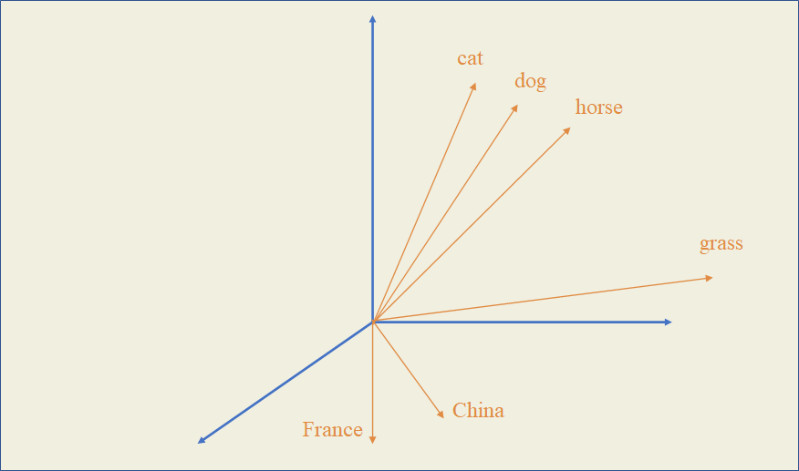
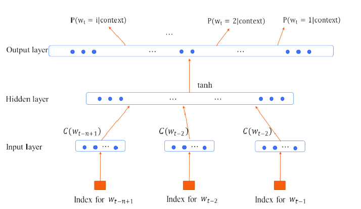
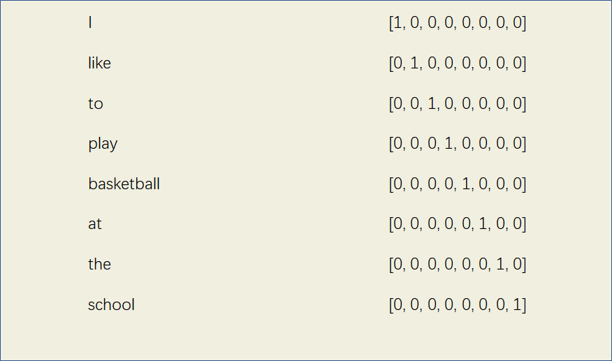
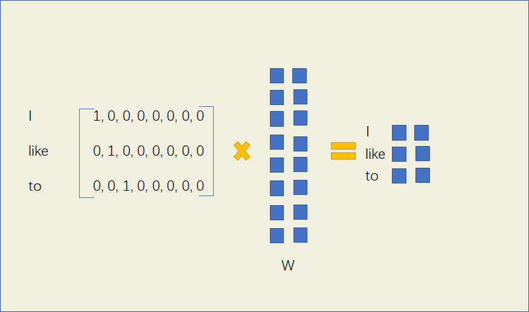
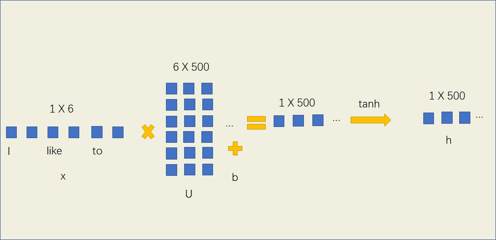
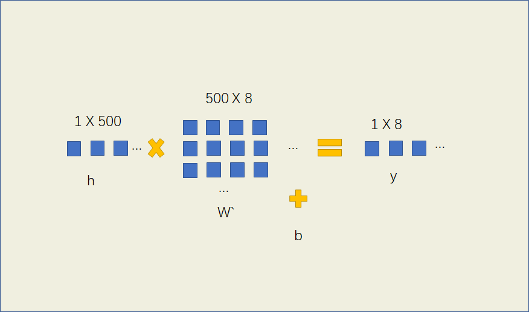

# 

在第一章中，为了计算一个句子成立的概率，我们介绍了统计语言模型，但是这种模型是一种离散模型，有很高的稀疏性，最终计算的结果可能会非常小。现在，我们可以使用神经网络来计算句子成立的概率，使用的神经网络可以是前馈神经网络、循环神经网络以及一些特别的网络结构，这一类模型叫做神经网络语言模型。

***神经网络语言模型的特点***

神经网络语言模型不仅训练出了一个语言模型（能够计算一个句子成立的概率），并且在过程中获得了每个词的词向量，这种向量可以在一定程度上反映出词语之间的相似性，获得这些词向量的过程也叫做词嵌入（word embeddings），就好像把不同的词嵌入到一个多维的空间中，使得它们之间具有联系。

***词向量的作用***

拥有了每个词的词向量表示，对很多NLP任务都有非常大的帮助。

比如在命名实体识别中，我们的任务时识别一个句子中出现的人名。通过深度学习，我们已经学到了第一个句子"John is a student"中John是人名，现在要找出第二个句子“Sam is a teacher”中的人名，因为student和teacher都是职业，词向量表示接近，所以很容易能够通过深度学习得到Sam也是人名，而不用再花费大量的句子进行学习。

也就是说，通过已经训练好的词向量，在一些任务中我们可以仅凭一个比较小的训练集就能得到一个较好的效果。

接下来，我们看一下这些词向量是怎么通过神经网络训练得到的。

# NNLM(Neural Network Language Model)

2003年，Bengio发表的《A Neural Probabilistic Language Model》成为使用神经网络训练语言模型的首创，主要使用的是最简单的前馈神经网络（Feed Forward Neural Net Language Model），这种模型被简称为NNLM。

NNLM不仅训练出了一个语言模型，并且在过程中获得了每个词的词向量，这种向量可以在一定程度上反映出词语之间的相似性。

基本思想是：给定一个语料库V，输入前n-1个单词，输出第n个单词出现的概率，通过前馈神经网络结构，用梯度下降法训练出中间的权重参数，使得输出单词是正确的概率最大。

## 初始化向量

我们想在训练神经网络的过程中得到每个词的词向量，因此需要先将它们初始化一个向量，One-hot就是一种很好的初始化方式。例如一个语料中有一句话：I like to play basketball at the school. 可以给这8个词用One-hot方法进行初始化词向量。

## 前向传播

现在我们想通过I like to这四个词，输出下一个词是play的概率，并使得这个概率尽量大，通过前馈神经网络来实现。

输入X为一个3 X 8的矩阵，如果设定我们要产生的词向量的为二维特征，则构建一个参数矩阵W，W的形状为8 X 2，这样相乘后我们就能得到一个3 X 2的词向量矩阵$x$

W是待训练的参数矩阵，刚开始可以进行任意的初始化，当神经网络训练好，即使得输出下一个词为basketball的概率尽量大的时候，此时的W就是理想的参数矩阵，也能获取每个词的词向量。

我们要将中间的词向量矩阵转化为概率的形式作为输出，先把获得的三个词向量连接成一个1 X 6的向量。引入一个隐藏层，使用tanh作为激活函数进行非线性映射，并给定权重矩阵U和偏置$b^{1}$，U的大小为6 X 一个参数u（一般设为500）

$h=\tanh \left(U * x+b^{1}\right)$

这样得到隐藏层的输出h，然后再传入输出层，$W^{\prime}$的大小为500 X 8（词表大小），这样最终输出词表大小的结果。

$y=W^{\prime} * h+b^{2}$

最后引入softmax函数进行归一化，使得所有输出词的概率之和为1。

$p=\frac{\exp y}{\sum_{i=1}^{n} \exp y_{i}}$

输出词表大小的一个向量，每个向量代表输出结果为每个词的概率，概率最大的词即为预测的结果。

## 计算损失

和普通前馈神经网络一样，通过前向传播得到预测值后，我们使用交叉熵函数计算神经网络的损失。

## 反向传播

和普通前馈神经网络一样，我们使用梯度下降法来对这个前馈神经网络更新参数。

学习到的最终参数$W$就是我们需要的词向量矩阵。

# RNN语言模型

除了前馈神经网络外，循环神经网络也能用于训练语言模型，得到词向量。相似地，把输入序列转换为one-hot编码，然后输入到循环神经网络里，输出为目标词的概率，通过梯度下降法更新参数，最终得到词向量。

# Word2Vec
2013年，Mikolov等人的论文***Efficient Estimation of Word Representations in Vector Space*** 提出了一种新的神经网络语言模型，相比于传统的神经网络语言模型拥有更好的词向量训练效果。

相比于NNLM和RNNLM，Word2Vec的重点不是将语言模型训练得多么好，而是关心过程中得到的词向量，尽可能地让词向量的表示更加准确。

NNLM和RNNLM的思想都是通过输入前$n-1$个词，预测第$n$个词的概率，而在word2vec中有两种不同的思想，产生了两种主要模型：

- Skip-gram: 输入为一个词语，预测它上下文词语出现的概率
- CBOW: 输入一个词语的上下文，预测这个词语出现的概率